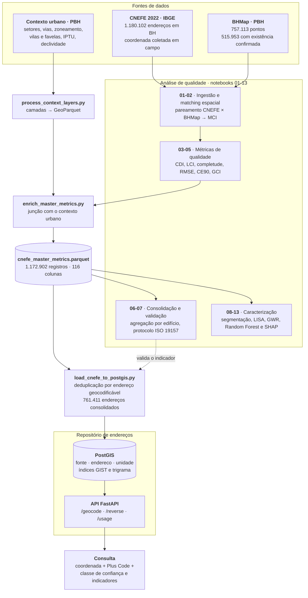
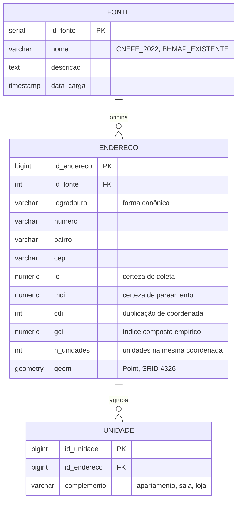

# Qualidade de geocodificação e repositório de endereços de referência

Avaliação da qualidade do CNEFE 2022 contra a base oficial de endereços de Belo Horizonte, e a estrutura que transforma esse resultado em um repositório de endereços consultável. Pesquisa de dissertação de mestrado em Ciência da Computação (PPGCC/DCC/UFMG).

## Visão geral

Geocodificar é converter a descrição textual de um endereço em coordenada. O resultado dessa conversão carrega um erro que quase nunca é informado a quem consome o dado: o serviço devolve um ponto, não a incerteza daquele ponto. Em análises de política pública e estudos socioespaciais, esse erro se propaga silenciosamente para dentro dos modelos.

O CNEFE 2022 é a primeira base de endereços brasileira com coordenadas coletadas em campo em escala nacional. Este projeto mede a qualidade dessas coordenadas em Belo Horizonte, usando como referência externa a base georreferenciada de endereços e lotes da Prefeitura, e usa o que essa medição revela para montar um repositório de endereços que devolve, junto da coordenada, um indicador de confiança calibrado empiricamente.

O repositório versiona as duas coisas: a **análise** que caracteriza a qualidade e a **estrutura** que materializa o repositório de endereços. O texto da dissertação, a bibliografia e os dados de entrada ficam fora do controle de versão.

## Arquitetura



Os três blocos têm papéis distintos. As **fontes** são todas públicas e nenhuma delas é versionada aqui. A **análise** produz um arquivo mestre com um registro por endereço do CNEFE, carregando as métricas de qualidade e as variáveis de contexto urbano; é o que sustenta a caracterização da qualidade. O **repositório** consome esse arquivo mestre: os endereços entram no PostGIS já com os indicadores calculados, e a API os devolve junto da coordenada, em vez de entregar um ponto sem qualificação.

## Métricas de qualidade

As métricas de certeza seguem a formulação de Davis Jr. & Fonseca (2007), adaptadas à escala do CNEFE e ao que é observável nesta base. A implementação está em [src/metrics.py](src/metrics.py).

| Métrica | O que mede | Como é calculada |
| --- | --- | --- |
| **LCI** | Certeza do método de coleta | Peso atribuído a `NV_GEO_COORD`: medição em campo vale mais que estimativa distante |
| **MCI** | Certeza do pareamento com a referência | Combina distância euclidiana e similaridade textual do logradouro |
| **PCI** | Certeza posicional pelo tipo construtivo | Penaliza apartamentos, onde a coordenada representa o edifício e não a unidade |
| **CDI** | Duplicação de coordenada | Quantos registros compartilham a mesma coordenada, arredondada a cerca de 1 m |
| **GCI** | Índice composto | `LCI × MCI × PCI` |
| **Completude** | Presença dos atributos do endereço | Ponderação de CEP, logradouro, complemento e localidade, no espírito da ISO 19157 |
| **CCR, DRS, CSI** | Coerência intrínseca da coordenada | Contenção no setor censitário declarado, distância à via mais próxima, isolamento em relação ao centróide do setor |
| **RMSE, CE90, MAE, mediana** | Acurácia posicional | Estatísticas sobre a distância a cada par BHMap |

O projeto trabalha com duas versões do índice composto. O **GCI original** usa o PCI heurístico, derivado do tipo de espécie e do complemento. O **GCI empírico** substitui esse termo por `1/CDI`, medindo a incerteza de identidade diretamente do dado em vez de inferi-la do rótulo: quando duzentos apartamentos compartilham um ponto, a coordenada identifica o edifício, não o endereço consultado. É o GCI empírico que segue para o repositório, e o Notebook 07 é quem o submete ao protocolo de validação de indicadores compostos.

## Pipeline analítico

Os notebooks são a espinha dorsal do trabalho e rodam em sequência. [run_pipeline.py](run_pipeline.py) encadeia notebooks e scripts ETL na ordem correta.

| Notebook | O que faz |
| --- | --- |
| [01_ingestao](notebooks/01_ingestao.ipynb) | Carrega e prepara o CNEFE e o BHMap |
| [02_matching](notebooks/02_matching.ipynb) | Pareia cada registro do CNEFE ao endereço BHMap correspondente e calcula o MCI |
| [03_eda_bases](notebooks/03_eda_bases.ipynb) | Análise exploratória das bases e motivação empírica das métricas intrínsecas |
| [04_lci_completude](notebooks/04_lci_completude.ipynb) | Métricas calculáveis apenas com o CNEFE: LCI e completude |
| [05_acuracia_gci](notebooks/05_acuracia_gci.ipynb) | Acurácia posicional contra o par BHMap e composição do GCI |
| [06_consolidacao_edificios](notebooks/06_consolidacao_edificios.ipynb) | Agrega por edifício e examina o viés de verticalização no CDI |
| [07_validacao_gci](notebooks/07_validacao_gci.ipynb) | Validação formal do GCI empírico: correlação com o erro real, validade discriminante, ablação |
| [08_eda_contextual](notebooks/08_eda_contextual.ipynb) | Caracteriza as camadas de contexto e faz o screening das covariáveis |
| [09_segmentacao_tipologica](notebooks/09_segmentacao_tipologica.ipynb) | Qualidade segmentada por tipologia construtiva e características do endereço |
| [10_segmentacao_uso](notebooks/10_segmentacao_uso.ipynb) | Qualidade por uso do solo e condição de assentamento |
| [11_analise_socioespacial](notebooks/11_analise_socioespacial.ipynb) | Estrutura espacial da qualidade: LISA com correção FDR, GWR e Spatial Error Model |
| [12_determinantes_gci](notebooks/12_determinantes_gci.ipynb) | Determinantes do GCI via Random Forest com validação cruzada e SHAP |
| [13_sintese_final](notebooks/13_sintese_final.ipynb) | Consolida as contribuições e as recomendações |

O pareamento do Notebook 02 forma 1.172.902 pares dentro do raio de busca, com 7.200 registros sem par. Essa taxa alta não é, por si só, evidência de acerto: o pareamento é por vizinho mais próximo dentro de 100 m combinado à similaridade textual, e é justamente o MCI que gradua a confiança de cada par.

## Repositório de endereços

O esquema em [src/db/init.sql](src/db/init.sql) separa o endereço geocodificável das unidades que compartilham a coordenada.



A separação resolve um problema concreto: um prédio de duzentos apartamentos ocupa uma linha em `endereco`, não duzentas. O complemento fica em `unidade`, preservado sem duplicar o ponto geocodificável, e `n_unidades` registra quantas unidades dividem aquela coordenada. O esquema é multi-fonte desde o início — `fonte` permite que outras bases entrem sem alterar o modelo, e a resposta da API sempre diz de onde veio o endereço.

Dois índices sustentam a consulta: GIST sobre a geometria, para busca por proximidade e vizinho mais próximo, e GIN trigrama sobre o logradouro, para o casamento aproximado do texto digitado.

### API

Prova de conceito em FastAPI ([src/api/](src/api/)). A consulta é normalizada para a forma canônica do repositório antes da busca, o que a torna robusta a abreviações e acentos.

| Rota | O que faz |
| --- | --- |
| `POST /geocode` | Recebe um endereço em texto e devolve até cinco candidatos ordenados |
| `POST /reverse` | Recebe uma coordenada e devolve o endereço mais próximo, com a distância em metros |
| `GET /usage` | Contabiliza as requisições por rota |

Toda resposta traz a fonte, o Plus Code da coordenada, os indicadores LCI, MCI, CDI e GCI empírico, e a classe de confiança derivada deles — alta, moderada ou baixa. É essa qualificação, e não o ponto isolado, que diferencia o repositório de um geocodificador convencional.

## Estrutura do repositório

```text
├── notebooks/                     # Núcleo analítico, na ordem de execução
│   └── 01_ingestao ... 13_sintese_final.ipynb
├── src/
│   ├── config.py                  # Caminhos, dicionários do CNEFE e parâmetros
│   ├── metrics.py                 # LCI, MCI, PCI, CDI, GCI, CCR, DRS, CSI, RMSE, CE90
│   ├── normalize.py               # Forma canônica de logradouros
│   ├── env.py                     # Credenciais do banco lidas do ambiente
│   ├── db/
│   │   └── init.sql               # Esquema PostGIS: fonte, endereco, unidade
│   └── api/                       # Prova de conceito do serviço
│       ├── main.py                # Rotas /geocode, /reverse e /usage
│       ├── database.py            # Sessão SQLAlchemy
│       └── schemas.py             # Contratos de entrada e saída
├── scripts/
│   ├── process_context_layers.py  # Camadas de contexto urbano para GeoParquet
│   ├── enrich_master_metrics.py   # Junção das métricas com o contexto
│   └── load_cnefe_to_postgis.py   # Carga do arquivo mestre no repositório
├── docker-compose.yml             # PostGIS e API
├── run_pipeline.py                # Execução encadeada de notebooks e ETLs
├── requirements.txt
├── .env.example                   # Modelo das credenciais locais
└── README.md
```

## Como executar

### Análise

1. Clone o repositório e crie um ambiente virtual com as dependências de `requirements.txt`.
2. Disponha os arquivos do CNEFE 2022 e as bases do BHMap em `data/raw/`.
3. Execute os notebooks em sequência a partir de `01_ingestao.ipynb`, ou use `python run_pipeline.py` para encadeá-los. O pipeline aceita retomada parcial, por exemplo `--from nb08`.

As versões fixadas em `requirements.txt` asseguram a reprodução. A extensão espacial do DuckDB é instalada em tempo de execução, conforme a nota no próprio arquivo.

### Repositório de endereços e API

1. Copie `.env.example` para `.env` e defina as credenciais. O `.env` não é versionado e nenhuma senha fica no código; o `docker compose` falha com mensagem explícita se as variáveis estiverem ausentes.
2. Suba os serviços com `docker compose up -d`. Na primeira execução, o `init.sql` cria as extensões PostGIS e `pg_trgm`, as tabelas e os índices.
3. Carregue os endereços consolidados pela análise: `python scripts/load_cnefe_to_postgis.py`.
4. Abra a documentação interativa em `http://localhost:8000/docs`.

## Dados e artefatos não versionados

Ficam fora do controle de versão, por serem dados externos, artefatos reprodutíveis ou material da dissertação:

- `data/` — CNEFE 2022 e bases do BHMap, todas obtidas de portais públicos
- `outputs/` — figuras, mapas e tabelas, regeneráveis pelo pipeline
- `references/` — bibliografia
- `docs/` — texto da dissertação e relatórios

## Referências

Os indicadores de certeza derivam da formulação de Davis Jr. & Fonseca (2007), levada à escala do CNEFE e adaptada ao que é observável nesta base.

- DAVIS JR., Clodoveu A.; FONSECA, Frederico T. Assessing the certainty of locations produced by an address geocoding system. *GeoInformatica*, v. 11, n. 1, p. 103–129, 2007.
- MARTINS, D.; DAVIS JR., Clodoveu A.; FONSECA, Frederico T. Geocodificação de endereços urbanos com indicação de qualidade. In: *Anais do XIII Simpósio Brasileiro de Geoinformática (GeoInfo)*, 2012.
- DAVIS JR., Clodoveu A.; ALENCAR, Rafael Odon de. Evaluation of the quality of an online geocoding resource in the context of a large Brazilian city. *Transactions in GIS*, v. 15, n. 6, p. 851–868, 2011.
- IBGE. *Nota metodológica: coordenadas geográficas dos endereços do Censo Demográfico 2022*. Rio de Janeiro, 2022.

## Sobre

Dissertação de mestrado em Ciência da Computação pela Universidade Federal de Minas Gerais, sobre incerteza posicional em geocodificação, formação de repositórios de endereços de referência e desigualdade espacial na qualidade do dado, com Belo Horizonte como estudo de caso.
